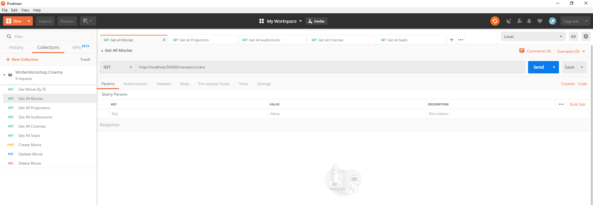
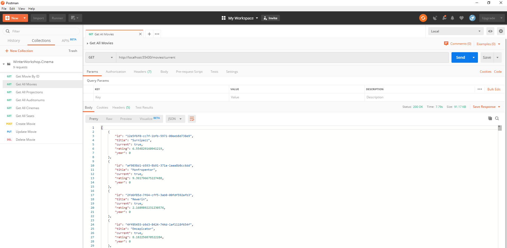

# Introduction
In this section we will cover fundamentals of Web Api

ASP .NET Core supports creating RESTful services, also known as web APIs, using C#.
To handle requests, a web API uses controllers. Controllers in a web API are classes that derive from ControllerBase.
This article shows how to use controllers for handling web API requests.

More about this topic on:
https://docs.microsoft.com/en-us/aspnet/core/web-api/?view=aspnetcore-3.0

## REST

### What is REST?

REST is acronym for Representational State Transfer. It is architectural style for distributed hypermedia systems.

### Guiding Principles of REST

*   **Client–server** – By separating the user interface concerns from the data storage concerns, 
    we improve the portability of the user interface across multiple platforms and improve scalability by simplifying the server components.
*   **Stateless** – Each request from client to server must contain all of the information necessary to understand the request,
    and cannot take advantage of any stored context on the server. Session state is therefore kept entirely on the client.
*   **Cacheable** – Cache constraints require that the data within a response to a request be implicitly or
    explicitly labeled as cacheable or non-cacheable. If a response is cacheable, then a client cache is given the right to reuse 
    that response data for later, equivalent requests.
*   **Uniform interface** – By applying the software engineering principle of generality to the component interface, 
    the overall system architecture is simplified and the visibility of interactions is improved. In order to obtain a uniform interface,
    multiple architectural constraints are needed to guide the behavior of components. REST is defined by four interface constraints: 
    identification of resources; manipulation of resources through representations; self-descriptive messages; and 
    hypermedia as the engine of application state.
*   **Layered system** – The layered system style allows an architecture to be composed of hierarchical layers 
    by constraining component behavior such that each component cannot “see” beyond the immediate layer with which they are interacting.
*   **Code on demand (optional)** – REST allows client functionality to be extended by downloading and executing code in the form of applets or scripts.
    This simplifies clients by reducing the number of features required to be pre-implemented.


These principles need to be satisfied if we want an interface to be referred as RESTful.

### What is RESTful?

A **RESTful** API is an application program interface (API) that uses HTTP requests to **GET**, **PUT**, **POST** and **DELETE** data. Based on **REST** 
architecture.

### HTTP verbs

**HTTPGET**

We use **GET**  to retrieve a resource. 

**Example**
```csharp
/// <summary>
/// Gets all current movies
/// </summary>
/// <returns>
/// Microsoft.AspNetCore.Http.StatusCodes.Status200OK
/// </returns>
[HttpGet]
[Route("current")]
public async Task<ActionResult<IEnumerable<Movie>>> GetAsync()
{
    var data = _movieService.GetAllMovies(true);
    return Ok(data);
}
```

**HTTPPUT**

We use **PUT** to change the state of or update a resource.

**Example**
```csharp
/// <summary>
/// Updates a movie
/// </summary>
/// <param name="id"></param>
/// <param name="movieModel"></param>
/// <returns>
/// Microsoft.AspNetCore.Http.StatusCodes.Status202Accepted
/// </returns>
[HttpPut]
[Route("{id}")]
public async Task<ActionResult> Put(Guid id, [FromBody]MovieModel movieModel)
{
    if (!ModelState.IsValid)
    {
        return BadRequest(ModelState);
    }

    var movieToUpdate = await _movieService.GetMovieByIdAsync(id);

    movieToUpdate.Title = movieModel.Title;
    movieToUpdate.Current = movieModel.Current;
    movieToUpdate.Year = movieModel.Year;
    movieToUpdate.Rating = movieModel.Rating;

    _movieService.UpdateMovie(movieToUpdate);

    return Accepted("movies//" + movieToUpdate.Id, movieToUpdate);
}
```

**HTTPPOST**

We use **POST** to create a resource.

**Example**
```csharp
/// <summary>
/// Adds a new movie
/// </summary>
/// <param name="movieModel"></param>
/// <returns>
/// Microsoft.AspNetCore.Http.StatusCodes.Status201Created
/// </returns>
[HttpPost]
public async Task<ActionResult> Post(MovieModel movieModel)
{
    if (!ModelState.IsValid)
    {
        return BadRequest(ModelState);
    }

    MovieDomainModel domainModel = new MovieDomainModel
    {
        Current = movieModel.Current,
        Rating = movieModel.Rating,
        Title = movieModel.Title,
        Year = movieModel.Year
    };

    var data = _movieService.AddMovie(domainModel);

    return Created("movies//" + data.Id, data);
}
```

**HTTPDELETE**

We use **DELETE** to remove a resource.

**Example**
```csharp
/// <summary>
/// Delete a movie by id
/// </summary>
/// <param name="id"></param>
/// <returns>
/// Microsoft.AspNetCore.Http.StatusCodes.Status202Accepted
/// </returns>
[HttpDelete]
[Route("{id}")]
public async Task<ActionResult> Delete(Guid id)
{
    var deletedMovie = _movieService.DeleteMovie(id);

    return Accepted("movies//" + deletedMovie.Id, deletedMovie);
}
```

More about these topics you can find on link: https://restfulapi.net

## Controllers

A controller is used to define and group a set of actions. An action (or action method) is a method on a controller which handles requests.
Controllers logically group similar actions together. This aggregation of actions allows common sets of rules, such as routing, caching and authorization,
to be applied collectively. Requests are mapped to actions through routing.

**Example**
```csharp
[ApiController]
[Route("[controller]")]
public class MoviesController : ControllerBase
{      
    private readonly IMovieService _movieService;

    private readonly ILogger<MoviesController> _logger;

    public MoviesController(ILogger<MoviesController> logger, IMovieService movieService)
    {
        _logger = logger;
        _movieService = movieService;
    }

   /// <summary>
    /// Gets all current movies
    /// </summary>
    /// <returns>
    /// Microsoft.AspNetCore.Http.StatusCodes.Status200OK
    /// </returns>
    [HttpGet]
    [Route("current")]
    public async Task<ActionResult<IEnumerable<Movie>>> GetAsync()
    {
        var data = _movieService.GetAllMovies(true);
        return Ok(data);
    }
}
```

More about controllers you can find:
*   https://docs.microsoft.com/en-us/aspnet/core/web-api/?view=aspnetcore-3.0
*   https://docs.microsoft.com/en-us/aspnet/core/mvc/controllers/actions?view=aspnetcore-3.0

## Routing

Routes are defined in startup code or attributes. Routes describe how URL paths should be matched to actions.
Routes are also used to generate URLs (for links) sent out in responses.

**Example**
```csharp
[ApiController]
[Route("[controller]")]
public class MoviesController : ControllerBase
{      
    private readonly IMovieService _movieService;

    private readonly ILogger<MoviesController> _logger;

    public MoviesController(ILogger<MoviesController> logger, IMovieService movieService)
    {
        _logger = logger;
        _movieService = movieService;
    }

   /// <summary>
    /// Gets all current movies
    /// </summary>
    /// <returns>
    /// Microsoft.AspNetCore.Http.StatusCodes.Status200OK
    /// </returns>
    [HttpGet]
    [Route("current")]
    public async Task<ActionResult<IEnumerable<Movie>>> GetAsync()
    {
        var data = _movieService.GetAllMovies(true);
        return Ok(data);
    }
}
```
This example show us that this action have route.

This example show us response when we have matched route in postman and in controller.


Paragraph about routing:
https://docs.microsoft.com/en-us/aspnet/core/mvc/controllers/routing?view=aspnetcore-3.0

## Startup class

ASP .NET Core apps use a Startup class, which is named Startup by convention. The Startup class:

*   Optionally includes a ConfigureServices method to configure the app's services. A service is a reusable component that provides app functionality. Services are registered in ConfigureServices and consumed across the app via dependency injection (DI) or ApplicationServices.
*   Includes a Configure method to create the app's request processing pipeline.

ConfigureServices and Configure are called by the ASP .NET Core runtime when the app starts:

**Example of Startup class**
```csharp
public class Startup
{
    public Startup(IConfiguration configuration)
    {
        Configuration = configuration;
    }

    public IConfiguration Configuration { get; }

    // This method gets called by the runtime. Use this method to add services to the container.
    public void ConfigureServices(IServiceCollection services)
    {
        services.AddDbContext<CinemaContext>(options =>
        {
            options
            .UseSqlServer(Configuration.GetConnectionString("CinemaConnection"))
            .UseQueryTrackingBehavior(QueryTrackingBehavior.NoTracking);                 
        });

        services.AddControllers();

        //Repositories
        services.AddTransient<IMoviesRepository, MoviesRepository>();
        services.AddTransient<IProjectionsRepository, ProjectionsRepository>();
        services.AddTransient<IAuditoriumsRepository, AuditoriumsRepository>();
        services.AddTransient<ICinemasRepository, CinemasRepository>();
        services.AddTransient<ISeatsRepository, SeatsRepository>();

        //Business Logic
        services.AddTransient<IMovieService, MovieService>();
        services.AddTransient<IProjectionService, ProjectionService>();
        services.AddTransient<IAuditoriumService, AuditoriumService>();
        services.AddTransient<ICinemaService, CinemaService>();
        services.AddTransient<ISeatService, SeatService>();
    }

    // This method gets called by the runtime. Use this method to configure the HTTP request pipeline.
    public void Configure(IApplicationBuilder app, IWebHostEnvironment env)
    {
        if (env.IsDevelopment())
        {
            app.UseDeveloperExceptionPage();
        }

        app.UseHttpsRedirection();

        app.UseRouting();

        app.UseAuthorization();

        app.UseEndpoints(endpoints =>
        {
            endpoints.MapControllers();
        });
    }
}
```

Paragraph about Startup class:
https://docs.microsoft.com/en-us/aspnet/core/fundamentals/startup?view=aspnetcore-3.0
 

## Configuration

App configuration in ASP .NET Core is based on key-value pairs established by configuration providers. Configuration providers read configuration data into key-value pairs from a variety of configuration sources:

*   Azure Key Vault
*   Azure App Configuration
*   Command-line arguments
*   Custom providers (installed or created)
*   Directory files
*   Environment variables
*   In-memory .NET objects
*   Settings files

**Example of appsettings.json**
```json
{
  "ConnectionStrings": {
    "CinemaConnection": "Data Source=AJERINIC-NEW;Initial Catalog=Cinema;Integrated Security=True;Connect Timeout=30;
                            Encrypt=False;TrustServerCertificate=False;ApplicationIntent=ReadWrite;MultiSubnetFailover=False"
  },
    "Logging": {
      "LogLevel": {
        "Default": "Information",
        "Microsoft": "Warning",
        "Microsoft.Hosting.Lifetime": "Information"
      }
    },
    "AllowedHosts": "*"
}
```
Paragraph about configuration:
https://docs.microsoft.com/en-us/aspnet/core/fundamentals/configuration/?view=aspnetcore-3.1